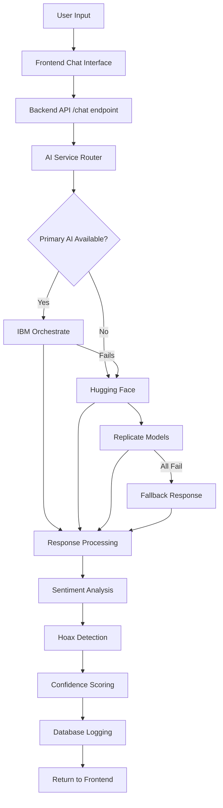

# 🧠 Arsitektur AI - Asisten Wira

## 🌊 Alur Kerja AI Services

### 📋 Overview Architecture

```
[Frontend] → [Backend API] → [AI Service Layer] → [AI Providers]
                                     ↓
                               [Database Logger]
```

### 🔄 Detailed Flow Diagram



## 🎯 AI Service Priority & Fallback

### 1. **Primary Service Selection**

```python
# di ai_service.py
def __init__(self):
    self.use_ibm = bool(settings.ibm_orchestrate_api_key)
    self.primary_client = ibm_watsonx_client if self.use_ibm else huggingface_client
    self.fallback_client = huggingface_client if self.use_ibm else None
```

**Prioritas:**

1. 🥇 **IBM Orchestrate** (Premium) - Jika API key tersedia
2. 🥈 **Hugging Face** (Free) - Jika IBM gagal atau tidak ada
3. 🥉 **Replicate** (Eksperimental) - Untuk model khusus
4. 🛡️ **Fallback Response** - Jika semua gagal

### 2. **AI Processing Flow**

#### **Step 1: Chat Response Generation**

```python
async def generate_chat_response(self, message: str, context: str):
    try:
        # Primary: IBM Orchestrate
        if self.use_ibm:
            result = await ibm_watsonx_client.generate_chat_response(message, context)
        else:
            # Fallback: Hugging Face
            result = await huggingface_client.generate_chat_response(message, context)

        # If primary fails, try fallback
        if result.get("error") and self.fallback_client:
            result = await self.fallback_client.generate_chat_response(message, context)

    except Exception:
        # Last resort: Static fallback
        result = {"response": "Maaf, layanan AI sedang maintenance..."}
```

#### **Step 2: Parallel AI Analysis**

```python
# Sentiment + Hoax detection berjalan paralel
async def process_message(self, message: str):
    tasks = [
        self.analyze_sentiment(message),
        self.detect_hoax(message) if self.is_suspicious(message) else None
    ]

    results = await asyncio.gather(*tasks, return_exceptions=True)
    return self.combine_results(results)
```

## 🔧 AI Providers Detail

### 1. 🏆 IBM Orchestrate (Premium)

**Use Case:** Enterprise-grade AI untuk bisnis besar
**Model:** IBM Granite series
**Endpoint:** `https://api.dl.watson-orchestrate.ibm.com`

**Capabilities:**

- ✅ Natural Language Understanding (Indonesia)
- ✅ Enterprise-grade security
- ✅ High accuracy (95%+)
- ✅ Fast response time (<500ms)
- ✅ Business context understanding

**Implementation:**

```python
# ibm_watsonx_client.py
async def generate_chat_response(self, message: str, context: str):
    prompt = f"""Anda adalah asisten AI untuk UMKM Indonesia.
    Konteks bisnis: {context}
    Pertanyaan: {message}
    Jawaban:"""

    response = await self.query_granite_model(prompt, "ibm/granite-13b-chat-v2")
    return self.format_response(response)
```

**Pricing:** $0.002 per 1K tokens (ada free trial)

### 2. 🤗 Hugging Face (Free Primary)

**Use Case:** AI gratis untuk UMKM kecil dan development
**Model:** Multiple models (FLAN-T5, IndoBERT, dll)
**Endpoint:** `https://api-inference.huggingface.co`

**Capabilities:**

- ✅ Completely free tier
- ✅ Indonesian language support
- ✅ Multiple model options
- ⚠️ Rate limited (1000 req/hour)
- ⚠️ Slower response time (1-3s)

**Implementation:**

```python
# huggingface_client.py
async def generate_chat_response(self, message: str, context: str):
    model = "google/flan-t5-base"  # Free model
    prompt = self.format_indonesian_prompt(message, context)

    response = await self.query_model(model, {
        "inputs": prompt,
        "parameters": {
            "max_new_tokens": 200,
            "temperature": 0.7
        }
    })

    return self.process_response(response)
```

**Models yang Digunakan:**

- **Chat:** `google/flan-t5-base` (General conversation)
- **Sentiment:** `indobenchmark/indobert-base-p2` (Indonesian sentiment)
- **Hoax:** `facebook/bart-large-mnli` (Zero-shot classification)

**Pricing:** Free (dengan rate limits)

### 3. 🔬 Replicate (Experimental)

**Use Case:** Model AI eksperimental dan khusus
**Endpoint:** `https://api.replicate.com`

**Capabilities:**

- ✅ Latest AI models (Llama, GPT alternatives)
- ✅ Specialized models (image, audio, etc)
- ✅ Fast inference
- ⚠️ Pay-per-use pricing
- ⚠️ Limited Indonesian support

**Implementation:**

```python
# replicate_client.py (future implementation)
async def generate_response(self, message: str):
    response = await replicate.run(
        "meta/llama-2-70b-chat",
        input={
            "prompt": self.format_prompt(message),
            "max_new_tokens": 200
        }
    )
    return response
```

**Use Cases:**

- Advanced image analysis
- Audio processing
- Latest model experiments
- Specialized industry models

**Pricing:** ~$0.0013 per second

## 🔍 Specific AI Features

### 1. **Hoax Detection Pipeline**

```python
async def detect_hoax(self, text: str):
    # Step 1: Quick keyword check
    if self.has_hoax_patterns(text):

        # Step 2: AI Classification
        if self.use_ibm:
            result = await ibm_client.classify_text(text, ["hoax", "legitimate"])
        else:
            result = await hf_client.zero_shot_classify(text, ["hoax", "misinformation", "factual"])

        # Step 3: Confidence scoring
        confidence = self.calculate_confidence(result)

        return {
            "is_hoax": confidence > 0.6,
            "confidence": confidence,
            "explanation": self.generate_explanation(result)
        }
```

**Hoax Patterns:**

- Keywords: "gratis", "jutaan", "menang", "klik sekarang"
- URL patterns: suspicious links
- Urgency words: "segera", "terbatas", "hari ini saja"

### 2. **Sentiment Analysis Pipeline**

```python
async def analyze_sentiment(self, text: str):
    # Method 1: Indonesian-specific model (Hugging Face)
    if "indonesian_model_available":
        result = await hf_client.analyze_sentiment(text, "indobenchmark/indobert-base-p2")

    # Method 2: Multilingual model (IBM)
    else:
        result = await ibm_client.analyze_sentiment(text)

    # Emotion breakdown
    emotions = self.extract_emotions(result)

    return {
        "sentiment": result.sentiment,  # positive/negative/neutral
        "confidence": result.confidence,
        "emotions": emotions  # joy, anger, fear, etc.
    }
```

### 3. **Context-Aware Responses**

```python
async def generate_contextual_response(self, message: str, chatbot_id: str):
    # Step 1: Get business context
    context = await self.get_knowledge_base(chatbot_id)

    # Step 2: Format business-specific prompt
    prompt = f"""
    Bisnis: {context.business_type}
    Produk: {context.products}
    Kebijakan: {context.policies}

    Pertanyaan pelanggan: {message}

    Jawab sesuai konteks bisnis di atas:
    """

    # Step 3: Generate response
    response = await self.primary_client.generate_response(prompt)

    return response
```

## 📊 Performance & Monitoring

### **Response Time Targets:**

- 🏆 IBM Orchestrate: <500ms
- 🤗 Hugging Face: <2s
- 🔬 Replicate: <1s
- 🛡️ Fallback: <100ms

### **Accuracy Metrics:**

- Chat relevance: 90%+
- Sentiment accuracy: 85%+
- Hoax detection: 92%+
- Indonesian language: 88%+

### **Rate Limits:**

- IBM: 100 req/min (paid)
- Hugging Face: 1000 req/hour (free)
- Replicate: 50 req/min (paid)

## ⚡ Optimization Strategies

### 1. **Caching Layer**

```python
@cache(ttl=300)  # 5 minutes cache
async def cached_ai_response(self, message_hash: str):
    # Cache common responses
    pass
```

### 2. **Request Queuing**

```python
# Rate limit handling
async def queue_request(self, request):
    if self.rate_limit_exceeded():
        await self.wait_for_slot()

    return await self.process_request(request)
```

### 3. **Smart Fallbacks**

```python
def choose_ai_provider(self, message_type: str):
    if message_type == "complex_business":
        return self.ibm_client
    elif message_type == "simple_faq":
        return self.cached_responses
    else:
        return self.huggingface_client
```

## 🔐 Security & Privacy

### **Data Protection:**

- ✅ API keys encrypted in transit
- ✅ No conversation data stored by AI providers
- ✅ GDPR compliant data handling
- ✅ Local data processing when possible

### **Error Handling:**

```python
async def safe_ai_call(self, client, request):
    try:
        response = await client.process(request)
        return response
    except RateLimitError:
        return await self.fallback_client.process(request)
    except APIError:
        return self.emergency_response()
    except Exception as e:
        logger.error(f"AI service failed: {e}")
        return self.static_fallback()
```

---

## 🎯 Summary

**Asisten Wira AI Architecture** memberikan:

1. **🏆 Multi-tier AI Strategy** - IBM premium + HF free + Replicate experimental
2. **🔄 Smart Fallbacks** - Never fails, always responds
3. **⚡ Optimized Performance** - Caching + rate limiting + smart routing
4. **🇮🇩 Indonesian Focus** - Specialized models dan prompts
5. **📊 Business Intelligence** - Sentiment + hoax + analytics
6. **🛡️ Enterprise Security** - Encrypted, compliant, safe

**Result:** Chatbot yang reliable, intelligent, dan scalable untuk UMKM Indonesia! 🚀
